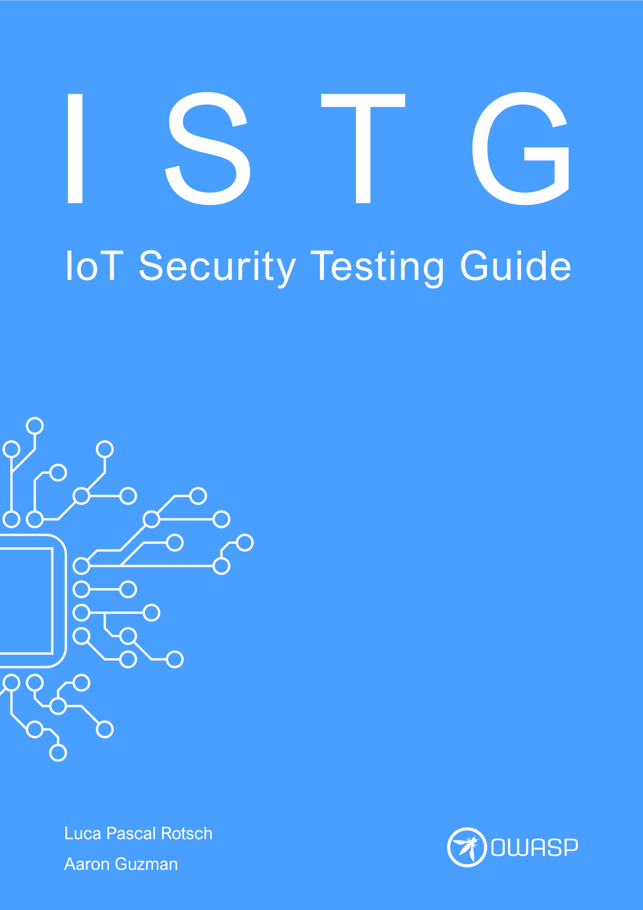

# OWASP IoT セキュリティテストガイド (OWASP IoT Security Testing Guide)

[![CC BY-SA 4.0][cc-by-sa-shield]][cc-by-sa]

OWASP IoT セキュリティテストガイドは IoT 分野におけるペネトレーションテストのための包括的な方法論を提供し、IoT 市場における革新と発展に柔軟に適応できるようにすると同時に、テスト結果の比較可能性を確保します。このガイドは IoT デバイスの製造者と運用者、並びにペネトレーションテストチームとの間のコミュニケーションを理解するためのものであり、共通の用語を確立することによって促進されます。

セキュリティ保証とテストカバレッジは、以下の IoT コンポーネントとそれぞれに適用されるテストケースカテゴリの概要で示すことができます。方法論、基礎となるモデル、テストケースのカタログは、個別に使用することも互いに連携して使用することもできるツールを提示します。

- 🔔[OWASP ISTG を読むにはここをクリック 📖📚]( https://owasp.org/owasp-istg/)🔔
- ✅ [最新のISTG チェックリストを入手する](https://github.com/OWASP/owasp-istg/tree/main/checklists)✅ 
- 📝 🔍 [ISTG に貢献する](https://owasp.org/www-project-iot-security-testing-guide/#div-contributing)

## 目次

1. [**はじめに**](./src/01_introduction/README.md)

2. [**IoT セキュリティテストフレームワーク**](./src/02_framework/README.md)

   2.1. [IoT デバイスモデル](./src/02_framework/device_model.md)

   2.2. [攻撃者モデル](./src/02_framework/attacker_model.md)

   2.3. [テスト方法](./src/02_framework/methodology.md)

3. [**テストケースカタログ**](./src/03_test_cases/README.md)

   3.1. [処理装置 (IOT-PROC)](./src/03_test_cases/processing_units/README.md)

   3.2. [メモリ (IOT-MEM)](./src/03_test_cases/memory/README.md)

   3.3. [ファームウェア (IOT-FW)](./src/03_test_cases/firmware/README.md)

      3.3.1. [インストール済みファームウェア (IOT-FW[INST])](./src/03_test_cases/firmware/installed_firmware.md)

      3.3.1. [ファームウェア更新メカニズム (IOT-FW[UPDT])](./src/03_test_cases/firmware/firmware_update_mechanism.md)

   3.4. [データ交換サービス (IOT-DES)](./src/03_test_cases/data_exchange_services/README.md)

   3.5. [内部インタフェース (IOT-INT)](./src/03_test_cases/internal_interfaces/README.md)

   3.6. [物理インタフェース (IOT-PHY)](./src/03_test_cases/physical_interfaces/README.md)

   3.7. [無線インタフェース (IOT-WRLS)](./src/03_test_cases/wireless_interfaces/README.md)

   3.8. [ユーザーインタフェース (IOT-UI)](./src/03_test_cases/user_interfaces/README.md)

## 関連作品

OWASP IoT セキュリティテストガイドで示されているコンセプト、モデル、テスト手順は Luca Pascal Rotsch による修士論文 **"モノのインターネット領域におけるデバイスのペネトレーションテストのための方法論の開発 (Development of a Methodology for Penetration Tests of Devices in the Field of the Internet of Things)"** に基づいています。

テストケースは以下の公開ソースから派生しています。

* OWASP [**"Web Security Testing Guide"**][owasp_wstg]
* OWASP [**"Firmware Security Testing Methodology"**][owasp_fstm]
* OWASP [**"Mobile Security Testing Guide"**][owasp_mstg]
* [**"IoT Pentesting Guide"**][iot_pentesting_guide] by Aditya Gupta
* [**"IoT Penetration Testing Cookbook"**][iot_penetration_testing_cookbook] by Aaron Guzman and Aditya Gupta
* [**"The IoT Hacker's Handbook"**][iot_hackers_handbook] by Aditya Gupta
* [**"Practical IoT Hacking"**][practical_iot_hacking] by Fotios Chantzis, Ioannis Stais, Paulino Calderon, Evangelos Deirmentzoglou, and Beau Woods
* それぞれのテストケースではほかのソースも参照しています

**協力者と支援者にも感謝します ([プロジェクト協力者と謝辞](./acknowledgements.md) を参照)**

[cc-by-sa]:  http://creativecommons.org/licenses/by-sa/4.0/
[cc-by-sa-shield]: https://img.shields.io/badge/License-CC%20BY--SA%204.0-lightgrey.svg
[owasp_wstg]: https://owasp.org/www-project-web-security-testing-guide/	"OWASP Web Security Testing Guide"
[owasp_fstm]: https://github.com/scriptingxss/owasp-fstm	"OWASP Firmware Security Testing Methodology"
[owasp_mstg]: https://owasp.org/www-project-mobile-security-testing-guide/	"OWASP Mobile Security Testing Guide"
[iot_pentesting_guide]: https://www.iotpentestingguide.com	"IoT Pentesting Guide"
[iot_penetration_testing_cookbook]: https://www.packtpub.com/product/iot-penetration-testing-cookbook/9781787280571	"IoT Penetration Testing Cookbook"
[iot_hackers_handbook]: https://link.springer.com/book/10.1007/978-1-4842-4300-8	"The IoT Hacker's Handbook"
[practical_iot_hacking]: https://nostarch.com/practical-iot-hacking	"Practical IoT Hacking"
