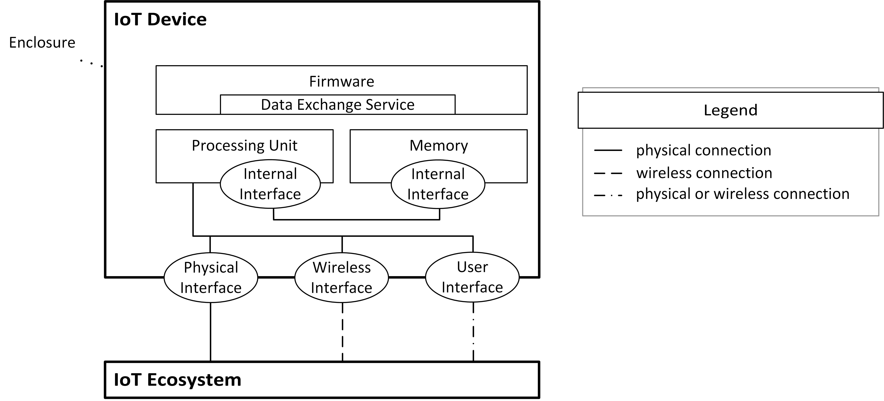

# 2.1. IoT デバイスモデル (IoT Device Model)

この章は IoT デバイスの一般的な構造を表す IoT デバイスモデルに焦点を当てます。デバイスモデルの作成は、ソリューションアプローチで定義された目標を達成するための最初のステップです ([1. はじめに](../01_introduction/README.md) 参照)。[2.2. 攻撃者モデル](./attacker_model.md), [2.3. 方法論](./methodology.md), [3. テストケースカテゴリ](../03_test_cases/README.md) で説明される以降のすべてのステップはデバイスモデルに基づいています。

## 関連研究

デバイスモデルは IoT プラットフォームのリファレンスアーキテクチャに基づいて構築されました。さらに、デバイスモデルはセキュリティのコンテキストで使用されるため、攻撃対象領域の形で潜在的な攻撃ベクトルも考慮しています。これらは以下の関連研究によって概説されています。

-   **["Comparison of IoT Platform Architectures: A Field Study based on a Reference Architecture"][reference_architecture]:** このペーパーの目的は、IoT エコシステムのリファレンスアーキテクチャを提案することです。このリファレンスアーキテクチャは「リファレンスアーキテクチャの目的は、統一された抽象的な用語集として機能し、さまざまなプラットフォームの比較を容易にすることであるため、意図的に抽象的なままにしています」 ([出典][reference_architecture])。このガイドで開発されたデバイスモデルは、特定の実装や設計に関係なく、さまざまな IoT デバイスの統一モデルとしても機能する必要があるため、Guth らの後のリファレンスモデル ([出典][reference_architecture]) を基礎としました。とはいえ、Guth らの後のモデル ([出典][reference_architecture]) は IoT デバイス自体の観点からみると表面的なものです。ここではデバイスを単一のコンポーネントとして示しており、(ドライバ以外の) 部品をそれ以上に区別していません。そのため、このガイドではテスト範囲 (特定のデバイス部品を含むか含まないか) をきめ細かく定義できないため、これでは十分ではありません。このガイドで紹介されているモデルでは、IoT デバイスの個々の部品をさらに区別するためにいくつかの調整が行われています。

-   **["IoT Attack Surface Areas Project"][owasp_iot_attack_surface_areas]:** OWASP はウェブやモバイルアプリケーションセキュリティなど、いくつかの技術分野におけるペネトレーションテスト方法論と一般的なセキュリティリスクのコレクション ("OWASP Top 10" とよばれる) を定期的に公表しています。その人気により、ペネトレーションテストに関する主要な情報源の一つとなっています。2014 年と 2018 年には、OWASP は IoT 分野に関するセキュリティリスクの Top 10 も公表しました。"IoT Attack Surface Areas Project" で言及されている対象領域は、潜在的な攻撃者に狙われる可能性のある IoT ソリューションの部品を表します。このリストは IoT デバイスおよび IoT エコシステム全般に関して多くの潜在的な攻撃ベクトルをすでにカバーしているという事実により、このガイド内で提案されているデバイスモデルの基礎としても使用しました。ただし、特にハードウェア側の観点から、IoT デバイス実装の詳細をさらに区別するためにいくつかの調整が行われました。さらに、"IoT Attack Surface Areas Project" はデバイス部品の単純なリストで構成しているだけであり、これらの部品が他のそれぞれとどのようにやり取りするのかを規定していません。また、デバイスの各部品 (またはそれぞれの攻撃対象領域) の特性を定義していないため、たとえば「デバイスメモリ」と「ローカルデータストレージ」などを区別することが困難になります。 ([出典][owasp_iot_attack_surface_areas])

## デバイスの境界

IoT デバイスに属するコンポーネントと周囲の IoT エコシステムのコンポーネントを区別するためには、まず IoT デバイスの境界を定義する必要があります。IoT デバイスは一般的に何らかの筐体で囲われており、デバイス内部の要素とデバイス外部の要素を (物理的に) 分離しています。

内部要素と外部要素間のやり取りはインタフェースを介してのみ可能です。このガイドでは、これらのインタフェースは筐体の一部とはみなされません。代わりに、これらのインタフェースは個別に分類されます ([インタフェース](#interfaces) 参照)。

次のセクションで説明するように、「コンポーネント」という用語はペネトレーションテストの対象となり得るアイテムを指します。そのため、このガイドではデバイス内部要素およびインタフェースをコンポーネントとみなします。

## コンポーネント

前のセクションで紹介したように、提案されたデバイスモデルは IoT デバイスを構成する部品の一般的な選択を提供する必要があります。これらの部品をコンポーネントと呼びます。すべてのコンポーネントは理論的には個別にテストできるソフトウェアやハードウェアの一部です。したがって、IoT デバイスのペネトレーションテスト範囲はコンポーネントのリストとして定義できます。

### デバイス内部要素

すべてのデバイス内部要素はデバイス筐体内に存在するコンポーネントです。そのため、これらは IoT デバイスの一部です。通常、IoT デバイスは以下の内部要素で構成しており、これらはすべて OWASP によって編集された攻撃対象領域のリスト ([出典][owasp_iot_attack_surface_areas]) に記載されています。

- **処理装置:** 処理装置はプロセッサともよばれ、データ処理タスクの管理と実行を担当します。これらのタスクはメモリからロードされる一連の命令として定義されます。デバイスにはそのコア機能 (ファームウェアで定義される) を処理する中央処理装置を少なくとも備えています。なお、より複雑なデバイスには特定のサブタスクに割り当てられた処理装置をさらに装備していることもあります。特殊なプロセッサにはマイクロプロセッサがあり、単一回路上に構築されています。マイクロコントローラはマイクロプロセッサであり、アナログとデジタルの入出力も備えています。これらは一般的にデバイスの動作を制御するために使用され、組み込み分野でよく使用されます。 ([出典][ekomp_processor])

  *例: x86 プロセッサ, ARM プロセッサ, AVR プロセッサ*

- **メモリ:** メモリは、プログラム (処理装置に対する命令) や情報などのデータをバイナリ形式で保存するために使用されます。メモリの種類に応じて、処理装置で処理中にデータを一時的に保存 (一次メモリまたはキャッシュ) したり、デバイスの電源がオフの状態でもデバイスにデータを永続的に保存する (二次メモリ) ために使用されます。特殊な二次メモリはフラッシュメモリです。省エネで発熱が少なく、可動部分がないので振動や磁場の影響を受けにくいため、多くのデバイスで一般的に使用されています。フラッシュメモリは半導体技術に基づいており、データへの高速かつ永続的なアクセス (読み取り、書き込み、削除) を提供できます。([出典][ekomp_flash_memory], [出典][ekomp_memory])

  *例: EEPROM, フラッシュメモリ*

- **ファームウェア:** 「ファームウェアはハードウェアデバイス上にプログラムされたソフトウェアプログラムまたは一連の命令です」 ([出典][tech_terms_firmware])。これはデバイスと、デバイス内部要素と外部要素間の通信 (データ交換サービスを介したデータ入出力) を制御するために使用されます。ファームウェアはメモリに保存され、処理装置によって実行されます。デバイスファームウェアに関しては、以下のコンポーネントがペネトレーションテストのターゲットになるかもしれません。

  -   **インストール済みファームウェア:** インストール済みファームウェアはデバイスに既にインストールされているファームウェアを指します。これは動的解析のターゲットになるかもしれず、通常は機密ユーザーデータの保存と処理を扱います。

  -   **ファームウェア更新メカニズム:** ファームウェア更新メカニズムはファームウェアの一部であり、ファームウェアパッケージの形式でファームウェアアップデートをデバイスにインストールする方法を定義します。ファームウェア更新プロセスの重要な責任は、適切なファームウェアパッケージのみがインストールおよび実行できるようにすることです。 [^1]

  *例: OS, RTOS, ベアメタル組み込みファームウェア*

- **データ交換サービス:** データ交換サービスはプログラム、またはプログラムの一部を指し、インタフェース (ネットワーク、バスなど) を介して二つ以上のコンポーネント間でデータを転送するために使用されます。これらのサービスはファームウェアの一部であり、データの送信、データの受信、その両方で使用できます。

  *例: ネットワークサービス、デバッグサービス、バスリスナー*

[^1]: ファームウェア更新メカニズムのテストを実行するには、ファームウェアパッケージが必要です。ファームウェアパッケージも個別に検査できるため、コンポーネントとみなすこともできます。しかし、このガイドではデバイス内部要素とデバイスインタフェースのみに焦点を当てているため、ファームウェアパッケージは対象外です。インストール済みファームウェアとは異なり、アップデートパッケージにはファームウェアヘッダも含まれており、重要なデータを含むかもしれません。

### インタフェース

インタフェースは二つ以上のコンポーネントを互いに接続するために必要です。デバイス内部要素間や、デバイス内部要素とデバイス外部要素間のやり取りはインタフェースを介してのみ可能です。どのコンポーネントがインタフェースによって接続されているかに基づいて、マシン対マシンまたは人間対マシンのインタフェースに分類できます。接続されているコンポーネントの少なくとも一つがデバイス内部要素である限り、インタフェース自体もデバイスの一部となります。

このガイドでは、以下の種類のインタフェースが区別されます。これらはすべて OWASP によって編集された攻撃対象領域のリスト ([出典][owasp_iot_attack_surface_areas]) に直接的または間接的に言及されています。

- **内部インタフェース (マシン対マシン):** これらのインタフェースはデバイス内部要素間の接続を確立するために使用され、デバイス筐体の外部からはアクセスできません。

  *例: JTAG, UART, SPI*

- **物理インタフェース (マシン対マシン):** 物理インタフェースは、コンポーネントやそれらのコンポーネントのそれぞれのインタフェース間の物理接続に基づいて、デバイス内部要素とデバイス外部要素間の接続を確立するために使用されます。そのため、物理インタフェースはデバイス筐体に組み込まれたソケットやポートを必要とし、デバイス外部からアクセスできます。

  *例: USB, イーサネット*

- **無線インタフェース (マシン対マシン):** 物理インタフェースと同様に、無線インタフェースもデバイス内部要素とデバイス外部要素間の接続を確立するために使用されます。ただし、無線インタフェース間の接続は物理的な接続ではなく、電波、光信号、その他の無線技術に基づいています。無線インタフェースはデバイス外部から、通常は物理インタフェースよりも遠くからアクセスできます。

  *例: Wi-Fi, Bluetooth, BLE, ZigBee*

- **ユーザーインタフェース (人間対マシン):** 上述の他のすべてのインタフェースとは対照的に、ユーザーインタフェースは二つのマシン間の接続を確立するためには利用されません。そうではなく、その目的はデバイス内部要素とユーザー間のやり取りを可能にすることです。このやり取りは、タッチディスプレイの場合などの物理接続か、カメラやマイクの場合などの無線接続のいずれかに基づきます。

  *例: タッチディスプレイ、カメラ、マイク、ローカルウェブアプリケーション (デバイスでホストされる)*

## デバイスモデルスキーム

デバイスモデルは上述のすべてのコンポーネントを組み合わせたものであり、以下の図で参照できます。読みやすくするためにカーディナリティは含まれませんが、各コンポーネントの複数のインスタンスが IoT デバイスに組み込まれているかもしれないことに注意しなければいけません。

他のモデル、たとえば [関連研究](#related-work) で言及されているモデルでは、デバイスのコンポーネントとしてセンサーとアクターを含んでいます。このガイドでは、センサーとアクターは、物理接続 (タッチセンサー、ドアコントロールなど) や無線接続 (マイク、温度センサーなど) を介して、デバイスの内部要素と外部要素やユーザー間のやり取りを可能にするため、それぞれ物理インタフェース、無線インタフェース、ユーザーインタフェースとみなされます。

場合によっては、デバイスがデバイス自体とみなされる部品を含むこと (つまり、ネストされたデバイス) も可能です。その場合、どのインタフェースを内部と外部に分類するかは、観察者の視点により依存します。決定要因は観察者とインタフェースの間の境界です ([デバイスの境界](#device-boundaries), [デバイス内部要素](#device-internal-elements), [インタフェース](#interfaces) を参照) 。

全体として、このガイドのコンテキストで特別に開発されたデバイスモデルはさまざまな異なる IoT デバイスの抽象表現を作成して共有するために使用できます。他のモデルとは対照的に、このモデルは IoT デバイスとそれを構成するコンポーネントのみに焦点を当てています。そのため、このモデルはデバイス実装をより詳細な方法で記述できます。次の章で開発されるモデルおよびコンセプトと組み合わせることで、実装されている特定のテクノロジや標準に関係なく、特定のデバイスに適用可能なテストケースのリストを作成できます。

[reference_architecture]: https://ieeexplore.ieee.org/document/7872918	"Comparison of IoT platform architectures: A field study based on a reference architecture"
[owasp_iot_attack_surface_areas]: https://wiki.owasp.org/index.php/OWASP_Internet_of_Things_Project#tab=IoT_Attack_Surface_Areas	"OWASP IoT Attack Surface Areas Project"
[tech_terms_firmware]: https://techterms.com/definition/firmware	"TechTerms.com"
[ekomp_processor]: https://www.elektronik-kompendium.de/sites/com/0309161.htm	"CPU - Central Processing Unit / Hauptprozessor"
[ekomp_flash_memory]: https://www.elektronik-kompendium.de/sites/com/0312261.htm	"Flash-Speicher / Flash-Memory"
[ekomp_memory]: https://www.elektronik-kompendium.de/sites/com/1812051.htm	"Speicherarchitektur"
