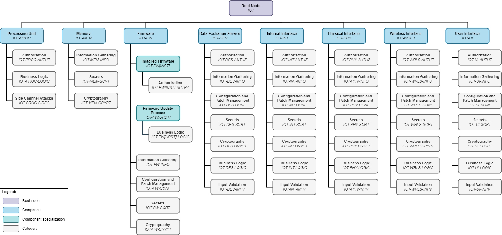

# 2.3. テスト方法 (Testing Methodology)

この章では、IoT デバイスのペネトレーションテストを実行するための方法論について説明します。これは [2.1. IoT デバイスモデル](./device_model.md) および [2.2. 攻撃者モデル](./attacker_model.md) で提示されたコンセプトに基づいており、既存のペネトレーションテストワークフローおよびフレームワークとともに使用できる補助として機能します。この方法論は IoT デバイスのペネトレーションテスト時に実行する必要があるテストの重要な側面で構成しています。したがって、各個別のデバイスコンポーネントのためのテストケースのカタログを含みます。前の章で説明したように、適用可能なテストケースの具体的な選択は、この方法論のコンテキストで設計されたデバイスモデルと攻撃者モデルを適用した結果に依存します。

最初に、この方法論を他のワークフローにどのように統合できるか、また、どのステップでこの方法論のモデルとコンセプトを使用できるかについて説明します。次に、テスト時に適用できて、特定のテストケースに限定されない、選択されたテスト技法について説明します。最後に、テストケースカタログの構造コンセプトについて説明します。

他の IoT ペネトレーションテストフレームワークと比較して、この方法論はより一般的でありながら包括的なアプローチに従っています。特定のテクノロジや標準の詳細に制限されることなく、IoT コンテキスト (テストの重要な側面) に関連する特定のセキュリティ問題を定義しています。そのため、この方法論は他のフレームワークよりも柔軟であり、IoT 分野の変動性を考慮すると重要な利点となります。とはいえ、この方法論はさまざまなテクノロジに適用でき、さらなる詳細化の可能性を提供します。

複数のコンポーネントに適用されるテストケースはこの章には含まれないことに注意しなければいけません。テストケースの完全なリストは [3. テストケースカタログ](../03_test_cases/README.md) にあります。

## 他のワークフローやフレームワークとの統合

効率性を達成するため、この方法論を組み込むために既存のワークフローを大幅に調整する必要はありません。以下では BSI ペネトレーションテストモデル ([出典][bsi_pentest]) の例に基づいて、この方法論を他のフレームワークにどのように統合できるかを示します。この場合、テストワークフロー全体を変更する必要はありません。

このガイドで提案されている方法論は以下のステップを容易にするために使用できます。

-   **テスト範囲とテスト観点の明確化:** この方法論は、デバイスと攻撃者のモデルの形で共通の用語を確立することで、BSI モデル ([出典][bsi_pentest]) のフェーズ 1 および 3 で契約者とのテストの目的と条件の明確化をサポートし、コミュニケーションを円滑にします。さらに、デバイスモデルは、潜在的な攻撃ベクトルを特定するために、特定の IoT デバイスのアーキテクチャと比較できる汎用的なスキームを提供することで、フェーズ 2 でテストチームをサポートします。

-   **テスト実行と文書化:** テストケースカタログはアクティブテスト (BSI モデルのフェーズ 4 ([出典][bsi_pentest])) の際にテスト担当者のガイドラインとして機能します。テスト範囲とテスト観点に応じて、適用可能なテストケースが定義され、テストで実行される必要があります。そのため、テストカタログはチェックリストとして使用して、必須テストがすべて実行されたことを確認します。また、実行したテストケースをレポートで参照できるため、フェーズ 5 において再現可能な方法でテスト手順を透過的に文書化できます。

## 階層構造の説明

以下では、テストケースカタログの全体的な構造とテストケースの一般的なレイアウトを定義します。

### テストケースのカタログの構造

テストケースのカタログは階層 (ツリー) 構造に従います。単一のルートノード (IOT) から始まり、デバイスモデルの各コンポーネントは子ノードとして表現され、それによってそれ自体のサブツリーを形成します。それから、さらにノードがコンポーネントノードの子として追加され、最終的に各テストケースがリーフノードになります。この構造を取り入れた一意の識別子が各ノードに割り当てられ、テストレポートや他の文書で参照できるようになります。

以下の階層レベルとノードの種類が定義されています。

- **コンポーネント (Component):** 最初の主要な階層レベルはコンポーネントです ([2.1. IoT デバイスモデル](./device_model.md) 参照)。コンポーネントの種類 (デバイス内部要素/インタフェース) は単純化のため、および付加価値がないため、階層に含めませんでした。

  *簡易表記: 英大文字 2 ～ 5 文字*

  *例: IOT-PROC, IOT-MEM, IOT-FW, IOT-DES, IOT-INT, IOT-PHY, IOT-WRLS, IOT-UI*

- **コンポーネントの特殊化 (Component Specialization) (オプション):** オプションのコンポーネントの特殊化を使用して、コンポーネントの特定部品やサンプルにのみ関連するテストケースを定義できます (例: インストール済みファームウェア - IOT-FW[INST] - ファームウェアコンポーネント IOT-FW の特殊化として、SPI - IOT-INT[SPI] - 内部インタフェースコンポーネント IOT-INT の特殊化として)。

  デフォルトでは、コンポーネントの特殊化は親ノードに対して定義されたすべてのカテゴリとテストケースを継承します (ファームウェアコンポーネント IOT-FW に対して定義されたすべてのテストケースは、特殊化されたインストール済みファームウェア IOT-FW[INST] に継承されます)。

  必要に応じて、たとえばファームウェア更新 IOT-FW[UPDT] の特殊化として、Over The Air ファームウェア更新 IOT-FW\[UPDT][OTA] など、特殊化を連鎖できます。この場合、二番目の特殊化は最初の特殊化に対して定義されたすべてのカテゴリとテストケースを継承するため、コンポーネント全般に対して定義されたすべてのテストケースも継承します。

  さらに、必要に応じて、コンポーネントの特殊化による継承から除外する必要があるカテゴリやテストケースのリストを定義することもできます。

  *簡易表記: 角かっこ内に英大文字 2 ～ 5 文字*

  *例: IOT-FW[INST], IOT-FW[UPDT]*

- **カテゴリ (Category):** 二番目の主要な階層レベルはカテゴリで、テストケースをグループ化するために使用できます。たとえば、認可に関連するすべてのテストケースをカテゴリ AUTHZ にグループ化できます。

  *簡易表記: 英大文字 2 ～ 5 文字*

  *例: IOT-\*-AUTHZ, IOT-\*-INFO, IOT-\*-CONF*

- **テストケース (Test Case):** 三番目の主要な階層レベルはテストケースです。詳しくは [3. テストケースカタログ](../03_test_cases/README.md) を参照してください。

  *簡易表記: テストケースの三桁の連番*

  *例: IOT-FW-INFO-001, IOT-FW-INFO-002, IOT-FW-INFO-003*

このような構造により、特定のデバイスやテストシナリオに関連しないノード (コンポーネント、コンポーネントの特殊化、カテゴリなど) を選択解除することで、適用可能なサブツリーを効率的に決定できます。以下の表は、各階層レベルのノードのリストの一例を示しています。このガイドに含まれるすべてのコンポーネントとカテゴリの概要を表の下の図に示しています。

コンポーネントとカテゴリの特殊化を使用すると、一般的なテストケースのカタログを拡張して、特定の標準やテクノロジのテストケースを含めることができます。親ノードからテストケースを継承することにより、これらのテストケースがデフォルトで子ノードにも適用されることを確保します。ただし、このガイドの執筆時点では、親ノードのテストケースが特定のケースで子ノードに適用できない可能性を排除できませんでした。そのため、特定の子ノードによる継承から除外されるテストケースのリストを指定できます。

カテゴリを拡張するもう一つの方法はカスタムのコンポーネント、カテゴリ、テストケースを追加することです。こうすることで、この方法論を拡張して、IoT エコシステムのデバイス外部要素などのさらなるコンポーネントを含めることもできます。

<table>
    <thead>
        <tr>
            <th>階層レベル</th>
            <th>ID</th>
            <th>説明</th>
        </tr>
    </thead>
    <tbody>
        <tr>
            <td>0</td>
            <td>IOT</td>
            <td>ルートノード</td>
        </tr>
        <tr>
            <td rowspan="14" valign="top">1</td>
            <td colspan="2"><b>コンポーネント (Component)</b></td>
        </tr>
        <tr>
            <td>IOT-PROC</td>
            <td>処理装置 (Processing Unit)</td>
        </tr>
        <tr>
            <td>IOT-MEM</td>
            <td>メモリ (Memory)</td>
        </tr>
        <tr>
            <td>IOT-FW</td>
            <td>ファームウェア (Firmware)</td>
        </tr>
        <tr>
            <td>IOT-DES</td>
            <td>データ交換サービス (Data Exchange Service)</td>
        </tr>
        <tr>
            <td>IOT-INT</td>
            <td>内部インタフェース (Internal Interface)</td>
        </tr>
        <tr>
            <td>IOT-PHY</td>
            <td>物理インタフェース (Physical Interface)</td>
        </tr>
        <tr>
            <td>IOT-WRLS</td>
            <td>無線インタフェース (Wireless Interface)</td>
        </tr>
        <tr>
            <td>IOT-UI</td>
            <td>ユーザーインタフェース (User Interface)</td>
        </tr>
        <tr>
            <td>IOT-*</td>
            <td>カスタムコンポーネント (Custom Component)<i>(将来の拡張用のプレースホルダ)</i></td>
        </tr>
        <tr>
            <td colspan="2"><b>コンポーネントの特殊化 (Component Specialization) (オプション)</b></td>
        </tr>
        <tr>
            <td>IOT-FW[INST]</td>
            <td>インストール済みファームウェア (Installed Firmware)</td>
        </tr>
        <tr>
            <td>IOT-FW[UPDT]</td>
            <td>ファームウェア更新メカニズム (Firmware Update Mechanism)</td>
        </tr>
        <tr>
            <td>IOT-*[*]</td>
            <td>カスタムコンポーネントの特殊化 (Custom Component Specialization)<i>(将来の拡張用のプレースホルダ)</i></td>
        </tr>
        <tr>
            <td rowspan="10" valign="top">2</td>
            <td colspan="2"><b>カテゴリ (Category)</b></td>
        </tr>
        <tr>
            <td>IOT-*-AUTHZ</td>
            <td>認可 (Authorization)</td>
        </tr>
        <tr>
            <td>IOT-*-INFO</td>
            <td>情報収集 (Information Gathering)</td>
        </tr>
        <tr>
            <td>IOT-*-CRYPT</td>
            <td>暗号技術 (Cryptography)</td>
        </tr>
        <tr>
            <td>IOT-*-SCRT</td>
            <td>シークレット (Secrets)</td>
        </tr>
        <tr>
            <td>IOT-*-CONF</td>
            <td>構成とパッチ管理 (Configuration and Patch Management)</td>
        </tr>
        <tr>
            <td>IOT-*-LOGIC</td>
            <td>ビジネスロジック (Business Logic)</td>
        </tr>
        <tr>
            <td>IOT-*-INPV</td>
            <td>入力バリデーション (Input Validation)</td>
        </tr>
        <tr>
            <td>IOT-*-SIDEC</td>
            <td>サイドチャネル攻撃 (Side-Channel Attacks)</td>
        </tr>
        <tr>
            <td>IOT-*-*</td>
            <td>カスタムカテゴリ (Custom Category) <i>(将来の拡張用のプレースホルダ)</i></td>
        </tr>
        <tr>
            <td rowspan="5" valign="top">3</td>
            <td colspan="2"><b>テストケース (Test Case)</b></td>
        </tr>
        <tr>
            <td>IOT-*-INFO-001</td>
            <td>ソースコードの開示 (Disclosure of Source Code)</td>
        </tr>
        <tr>
            <td>IOT-*-INFO-002</td>
            <td>実装内容の開示 (Disclosure of Implementation Details)</td>
        </tr>
        <tr>
            <td>IOT-*-INFO-003</td>
            <td>エコシステム内容の開示 (Disclosure of Ecosystem Details)</td>
        </tr>
        <tr>
            <td>IOT-*-*-*</td>
            <td>カスタムテストケース (Custom Test Case) <i>(将来の拡張用のプレースホルダ)</i></td>
        </tr>
    </tbody>
</table>

### テストケースの構造

リーフノードで表現される個々のテストケースは以下のセクションに分割されます。

-   **必要条件 (Requirements):** 必要条件セクションではテストケースを実行するために必要な物理および認可アクセスレベルを定義します。これらの必要条件は、ターゲットデバイスの特定の実装とその運用環境など、特定のテスト条件に依存するため、一般にテストケースに適用されるアクセスレベルの範囲が定義されるかもしれません。

-   **要旨 (Summary):** 要旨セクションはテストケースのベースとなるセキュリティ問題の全体的な説明を含みます。

-   **テスト目的 (Test Objectives):** テスト目的セクションでは、テスト担当者が実施する必要があるチェックのリストを示します。これらのチェックを実行することで、テスト担当者はデバイスが要旨に記されたセキュリティ問題の影響を受けるかどうかを判断できます。

-   **対応策 (Remediation):** 対応策セクッションはセキュリティ問題を解決するために適用できる可能性のある対策に関する推奨事項で構成しています。ただし、これらの推奨事項は大まかな提案にすぎません。デバイスの実装に関して詳細な対策を導き出すのは製造業者や事業者の責任です。

[bsi_pentest]: https://www.bsi.bund.de/SharedDocs/Downloads/EN/BSI/Publications/Studies/Penetration/penetration_pdf.pdf?__blob=publicationFile&v=1	"Study: A Penetration Testing Model"
[nvd]: https://nvd.nist.gov	"National Vulnerability Database"
[owasp_fuzzing]: https://owasp.org/www-community/Fuzzing	"Fuzzing"
